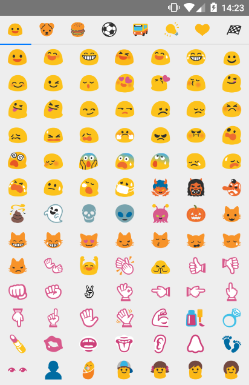
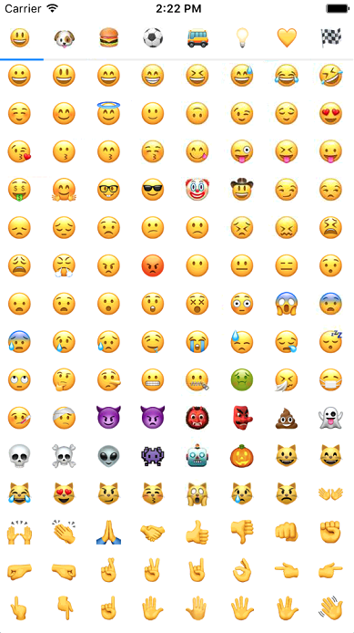

# react-native-emoji-picker-panel

The component has both iOS and Android support.






### Installation 
```npm install react-native-emoji-picker-panel --save```
### Properties
| Prop | Type | Description | Default |
|---|---|---|---|
|**`visible`**|Boolean||`true`|
|**`emojiSize`**|Number|Size of emoji|`40`|
|**`onEmojiSelected`**|function|Callback on emoji selected|`false`|
|**`tabViewProps`**|Boolean|Props of react-native-scrollable-tab-view https://github.com/skv-headless/react-native-scrollable-tab-view||
|**`itemPerRow`**|Number|The number of items to render per row|`7`|
|**`style`**|Object|Style of container||
